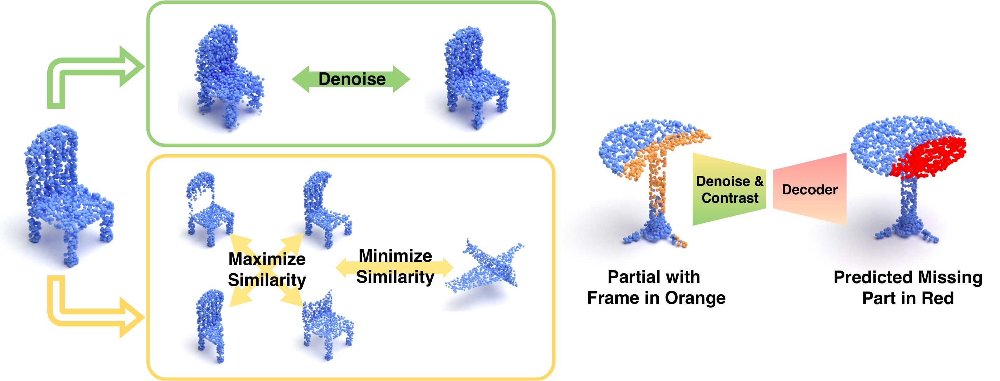

# DeCo: Denoise and Contrast for Category Agnostic Shape Completion

<p align="center">  
  
</p> 

## Introduction
**[PyTorch](https://pytorch.org)** implementation for the paper **[Denoise and Contrast for Category Agnostic Shape Completion (CVPR 2021.)](http://arxiv.org/abs/2103.16671)**. <br>
**Repository still under construction/refactoring. In case of any issue feel free to email me at antonio.alliegro@polito.it**

## Video and Poster

[](https://youtu.be/6L4WfcPzsE8)

<br>
You can also take a look at our **[poster](https://github.com/antoalli/Deco/blob/main/assets/deco_cvpr21_poster.pdf)**

## Dependencies

* Python 3.7.9
* CUDA 10.0
* G++ or GCC 7.5.0.
* [PyTorch](http://pytorch.org/). Codes are tested with version 1.2.0

1. Create a conda environment with:
```bash
# Create and activate a new conda environment
conda create --name deco_env python=3.7.9
conda activate deco_env
```
2. After activating the deco_env environment:
```bash
./install_requirements.sh
```
Due to incompatibility between PyTorch and Open3D it is mandatory to import first Open3d and then PyTorch. If you encounter script crash (*free(): invalid pointer*) at the beginning of the training you probably swapped the imports (https://github.com/pytorch/pytorch/issues/19739). <br>
Moreover, to compile the chamfer module some variables referring to CUDA/CUDNN installation must be exported. Check the *install_requirements* script to verify that the paths in there match your local CUDA installation folder.

## Dataset
You can use the *download_dataset.sh* script to download ShapenetPart dataset.

## Training
Some example of training scripts
```bash
# Train Deco: Denoise and Contrast Pretexts, w/ Frame Regularization
python train_deco.py --data_root data/shapenetcore_partanno_segmentation_benchmark_v0 --exp_name deco1280_512_wFrame512_sn13 --config configs/deco_config.json --parallel -P1 1280 -P2 512 --raw_weight 1

# Others:
# Train Deco: Denoise and Contrast Pretexts, w/o Frame Regularization
python train_deco.py --data_root data/shapenetcore_partanno_segmentation_benchmark_v0 --exp_name deco1280_512_noFrame_sn13 --config configs/deco_config.json --parallel -P1 1280 -P2 512 --raw_weight 0

# train: w/o Denoise and Contrast Pretexts, w/ Frame Regularization
# no pretexts at all
python train_deco.py --data_root data/shapenetcore_partanno_segmentation_benchmark_v0 --exp_name noPretexts1280_512_wFrame512_sn13 --config configs/noPretexts_config.json --parallel -P1 1280 -P2 512 --raw_weight 1

# train: w/o Denoise and Contrast Initialization, w/o Frame Regularization
# no pretexts at all
python train_deco.py --data_root data/shapenetcore_partanno_segmentation_benchmark_v0 --exp_name noPretexts1280_512_noFrame_sn13 --config configs/noPretexts_config.json --parallel -P1 1280 -P2 512 --raw_weight 0
```

Code is tested on 2 x 24gb Titan RTX with batch size 30 and parallelism implemented through PyTorch DataParallel. Ablation experiments run with similar configuration on  4 x 16gb Tesla v100.

## Pre-trained model

Pretrained model can be found in 'checkpoints' directory.

## Notes

- As said before, this repository is still under construction. I'm currently refactoring all code in order to make it readable and naturally follow the main paper structure. More useful resources will be added in the next days.

## Cite
Please cite our work if you find it useful:
```latex
@InProceedings{Alliegro_2021_CVPR,
    author    = {Alliegro, Antonio and Valsesia, Diego and Fracastoro, Giulia and Magli, Enrico and Tommasi, Tatiana},
    title     = {Denoise and Contrast for Category Agnostic Shape Completion},
    booktitle = {Proceedings of the IEEE/CVF Conference on Computer Vision and Pattern Recognition (CVPR)},
    month     = {June},
    year      = {2021},
    pages     = {4629-4638}
}
```
